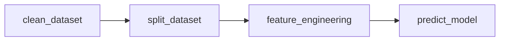

# SMU IS614 IoT Step Tracker

Table of Contents
------------

| S/NO | Section |
| --- | --- |
| 1. | [About this Project](#1) | 
| 2. | [Workflow](#2) | 
| 3. | [Project Organization](#3) | 
| 4. | [Setup Environment](#4) | 
| 5. | [Teardown Environment](#5) | 
| 6. | [Development Workflow](#6) | 
| 7. | [Pull Requests](#7) | 
| 8. | [Project artifacts](#8) |


About this Project <a name="1"></a>
------------

In this project, \<writeup here\>

IoT Architecture <a name="2"></a>
------------

The main architecture of this project \<architecture here\> 


### ML Pipeline

Run using 

```bash
make prediction_pipe
```

### Predict Pipeline



| Components | Description |
| --- | --- |
| `clean_dataset`  | 1. Checks if the dataset exists in `data/raw`<br>2. Reads the file and performs pre-processing<br>3. Save outputs in `data/interim` for feature engineering  |
| `split_dataset`  | 1. Split dataset into `train` and `test` based on random split |
| `build_features` | 1.. Drops unnecessary columns for training<br> 2. Encodes categorical variables<br>3. Bin numerical variables<br>4. Imputing missing data for MAR variables<br>5. Save outputs in `data/final`  |
| `train_models` | 1. Trains specified candidate models (or train all models if not specified)<br>2. Tune hyperparameters for each model<br>3. Save model weights in `models` folder |
| `evaluate_model`| 1. Evaluate models based on pre-defined metrics<br>2. Output charts to `reports/figures` |
| `predict_model`| 1. Loads pre-trained models from `models`<br>2. Output predictions in a `.pickle` format |

Project Organization <a name="3"></a>
------------

The repository is structured in the following hierarchy


Setting up the ML environment <a name="4"></a>
------------

### Prerequisties 

* Download and install [anaconda](https://www.anaconda.com/products/distribution) 

* Download [docker](https://www.docker.com/products/docker-desktop/) 

* Download [git](https://git-scm.com/downloads) 


Run the following terminal commands 

Ensure that you are logged into docker hub. Then run the following command to set up the docker environment 

```
$ docker-compose up
```
 
The command launches an Ubuntu-based distro, and a Jupyter Lab environment for running the pipelines. Launch the Lab environment from the terminal by clicking on the generated URL

Check that the environment is correctly set up using the following command:

```bash
make test_environment
```

Tearing down the environment <a name="5"></a>
------------

Close the browser by double tapping ctrl + c on the terminal

Run the following command on the terminal to tear down the environment 

```
docker-compose down
```

* Initial EDA is saved in [notebooks]()

* Models are saved in the [models]()

* Confusion matrices generated from the training process are saved in [reports/figures/confusion_matrix]()

* ROC curves generated from the training process are saved in [reports/figures/roc]()

* The error analysis is saved in [notebooks]()